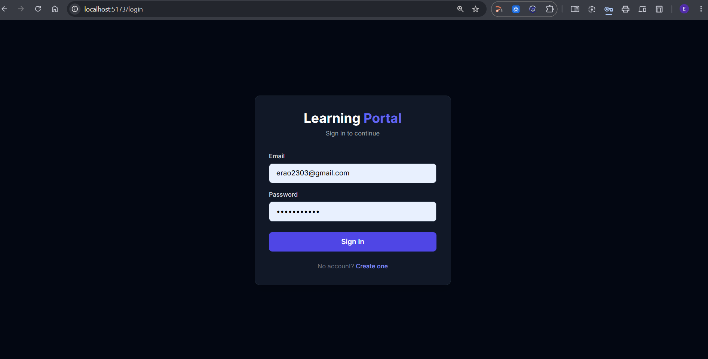
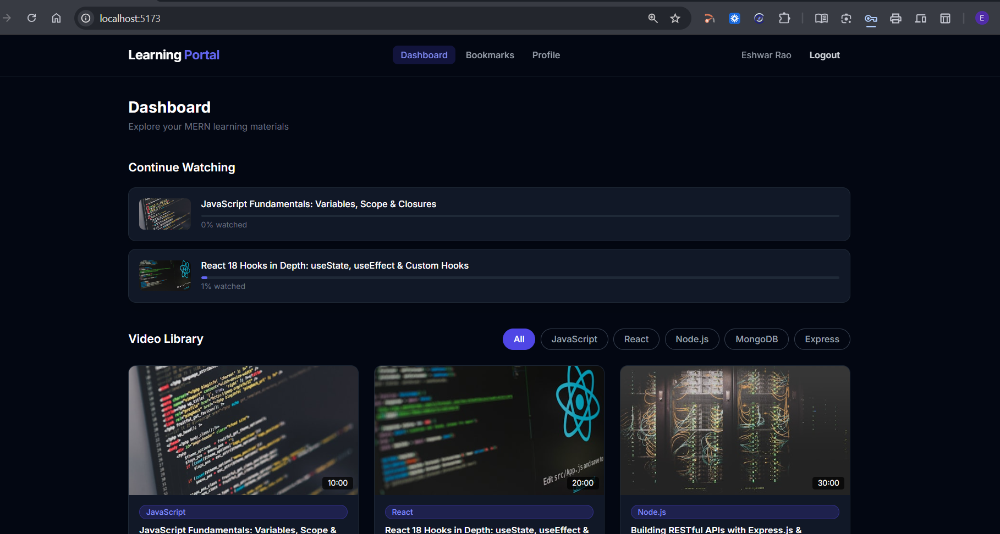
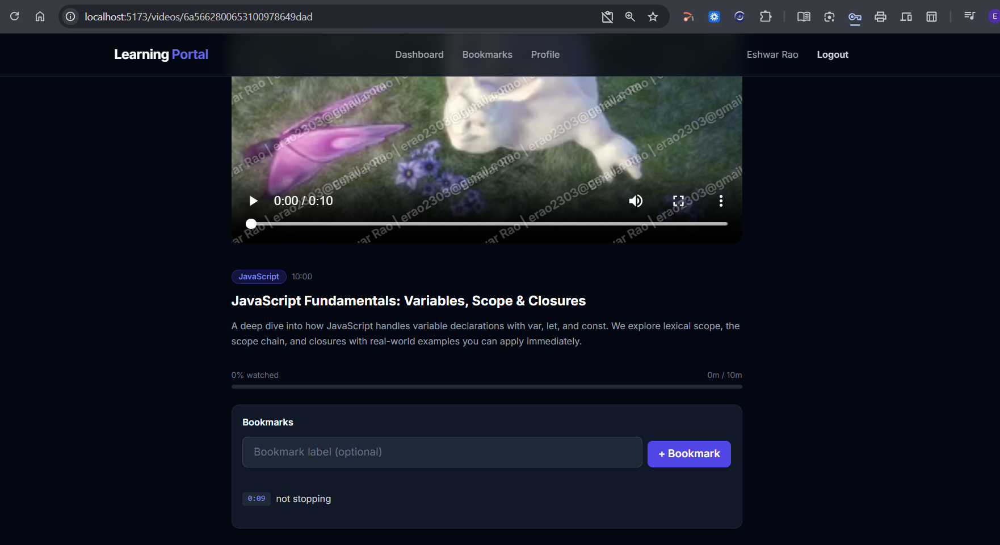
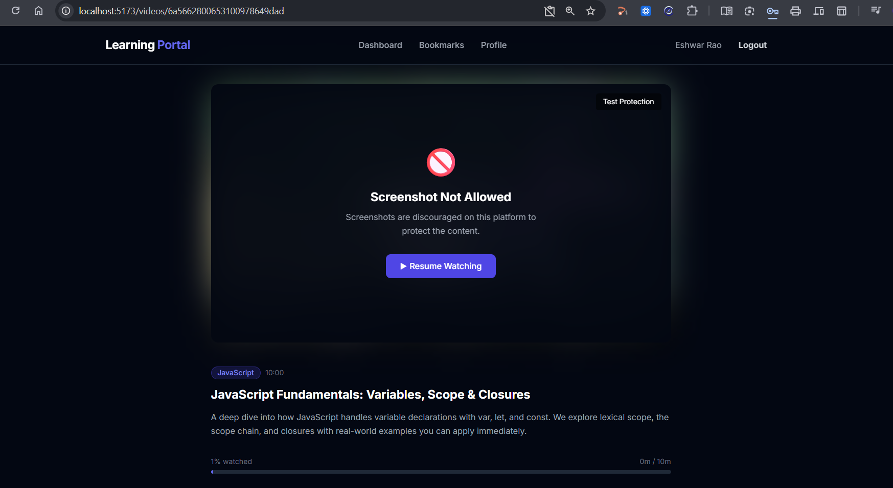
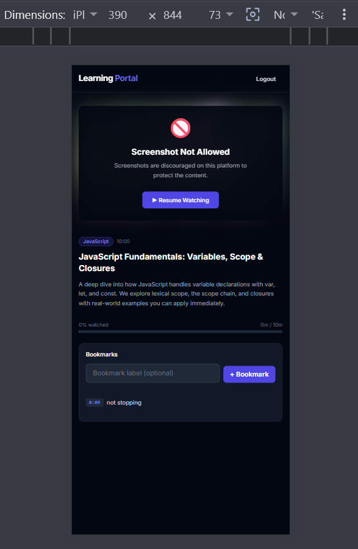

# Learning Portal Development

A full-stack MERN Learning Portal where students can watch educational videos, create timestamped bookmarks, track progress, and resume learning across sessions.

## Tech Stack

- **Frontend:** React 18, Vite, React Router DOM, Tailwind CSS, Axios
- **Backend:** Node.js, Express.js, MongoDB + Mongoose
- **Authentication:** JWT (JSON Web Tokens), bcryptjs
- **Video Player:** ReactPlayer (HTML5)

## Features

### Core Requirements
- Student-friendly responsive UI (desktop + mobile)
- Video player with custom controls
- Create multiple bookmarks per video with timestamps
- Click any bookmark to resume playback from that exact timestamp
- Persistent bookmark storage via MongoDB backend API
- Watch progress indicator and "Continue Watching" section
- Recently watched videos tracking

### Bonus Features
- Authentication (Login / Signup / JWT)
- Edit and delete bookmarks
- Watermark overlay with user identity
- Screenshot protection mechanism
- Admin video upload capability
- Responsive design for all screen sizes

## Screenshot Protection Approach

This application implements a **best-effort browser-based deterrent** to discourage screenshots during video playback.

### Implemented Mechanisms
1. **Visual Watermark**: Diagonal repeating overlay displaying the logged-in user's name and email at 25% opacity, making leaked screenshots traceable.
2. **Keyboard Blocking**: Intercepts PrintScreen (keydown + keyup), Ctrl+S (save), and Ctrl+P (print) — pauses video and shows a full-screen warning overlay.
3. **Context Menu Disable**: Right-click on the video area is blocked with a tooltip notification.
4. **Tab Switch Detection**: Uses Page Visibility API to pause video and apply a blur overlay when the user switches tabs.
5. **Window Blur Heuristic**: Detects screenshot tools (Snipping Tool, Lightshot) that steal window focus and triggers the same protection.
6. **Clipboard Flush**: Clears the system clipboard 100ms after PrintScreen detection to wipe auto-copied screenshots.
7. **CSS Protection**: `user-select: none` prevents text selection on video content.

### Limitations
True OS-level screenshot prevention (e.g., black screen on capture like Netflix/Hotstar DRM) requires **Widevine/PlayReady DRM modules** or native application wrappers, which are not available in standard browser-based MERN applications. This implementation provides the strongest feasible deterrent within the constraints of a web application.

## Setup Instructions

### Prerequisites
- Node.js v18+
- MongoDB Atlas account (or local MongoDB)

### 1. Clone the repository
```bash
git clone https://github.com/eshwarrao123/Learning-Portal-Development
cd Learning-Portal-Development
```

### 2. Environment Variables

**Server (`/server/.env`)**
```env
PORT=5000
MONGO_URI=your_mongodb_connection_string
JWT_SECRET=your_jwt_secret_key
JWT_EXPIRES_IN=7d
CLIENT_URL=http://localhost:5173
```

**Client (`/client/.env`)**
```env
VITE_API_BASE_URL=http://localhost:5000/api
```

### 3. Install dependencies
```bash
cd server
npm install

cd ../client
npm install
```

### 4. Seed the database
```bash
cd server
npm run seed
```
*Creates 4 sample videos and a demo user: student@gvcc.com / password123*

### 5. Run the application
```bash
# Terminal 1 — Backend
cd server
npm run dev

# Terminal 2 — Frontend
cd client
npm run dev
```
Open `http://localhost:5173`

## API Endpoints

| Method | Endpoint | Description | Auth |
|---|---|---|---|
| POST | `/api/auth/register` | Register new user | No |
| POST | `/api/auth/login` | Login and receive JWT | No |
| GET | `/api/auth/me` | Get current user | Yes |
| GET | `/api/videos` | List all videos | Yes |
| GET | `/api/videos/:id` | Get single video | Yes |
| POST | `/api/bookmarks` | Create bookmark | Yes |
| GET | `/api/bookmarks` | Get user's bookmarks | Yes |
| PUT | `/api/bookmarks/:id` | Edit bookmark | Yes |
| DELETE | `/api/bookmarks/:id` | Delete bookmark | Yes |
| POST | `/api/progress/:videoId` | Update watch progress | Yes |
| GET | `/api/progress/continue` | Get continue watching list | Yes |

## Project Structure
```text
learning-portal/
├── server/
│   ├── config/        # Database connection
│   ├── controllers/   # Route logic
│   ├── middleware/    # Auth, error handling
│   ├── models/        # Mongoose schemas
│   ├── routes/        # API routes
│   ├── scripts/       # Seed data
│   └── utils/         # Helpers (token, logger)
├── client/
│   ├── src/
│   │   ├── components/  # Reusable UI
│   │   ├── context/       # AuthContext
│   │   ├── hooks/         # Custom hooks
│   │   ├── pages/         # Route pages
│   │   └── utils/         # API instance
│   └── public/
└── screenshots/       # Application screenshots
```

## Screenshots

### Login & Dashboard
| Login | Dashboard |
|:---:|:---:|
|  |  |

### Video Player & Protection
| Video Player | Screenshot Protection |
|:---:|:---:|
|  |  |

### Mobile View
| Mobile Responsive |
|:---:|
|  |

## Demo
- **Screen Recording:** [https://www.loom.com/share/edb0d41e6bd34b35ae85c9624c6d2f9e]

